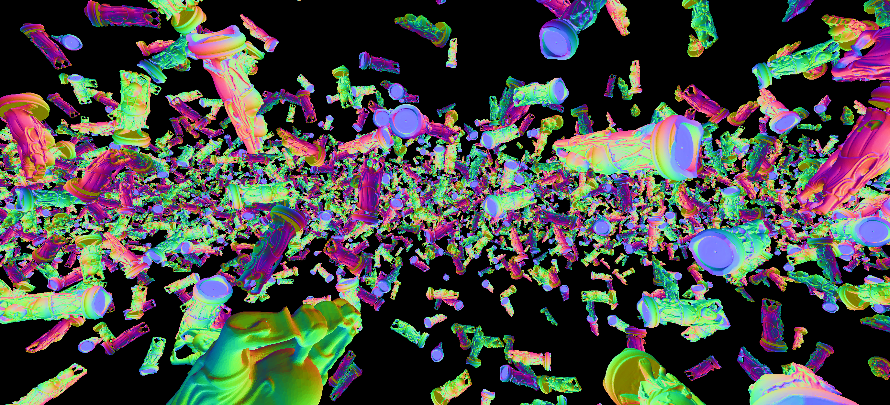
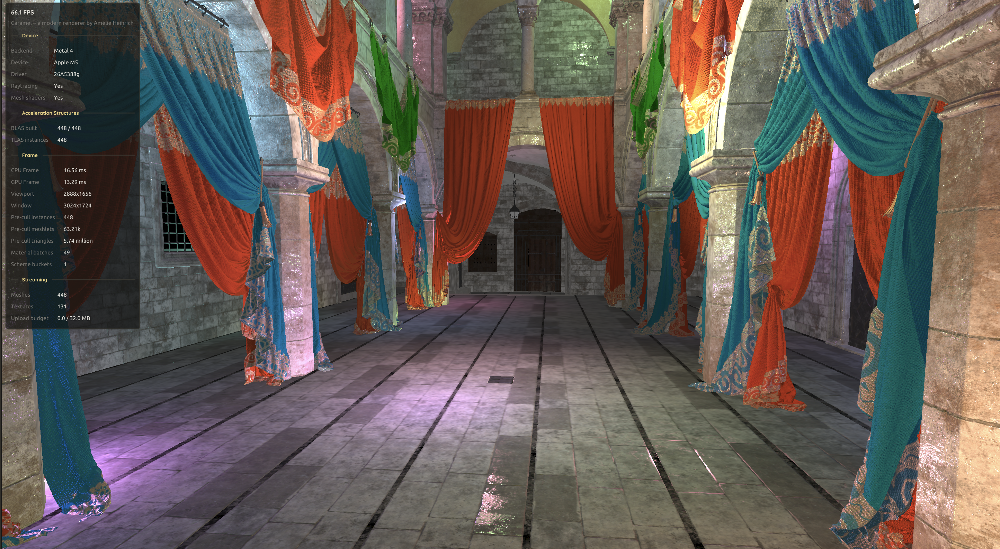
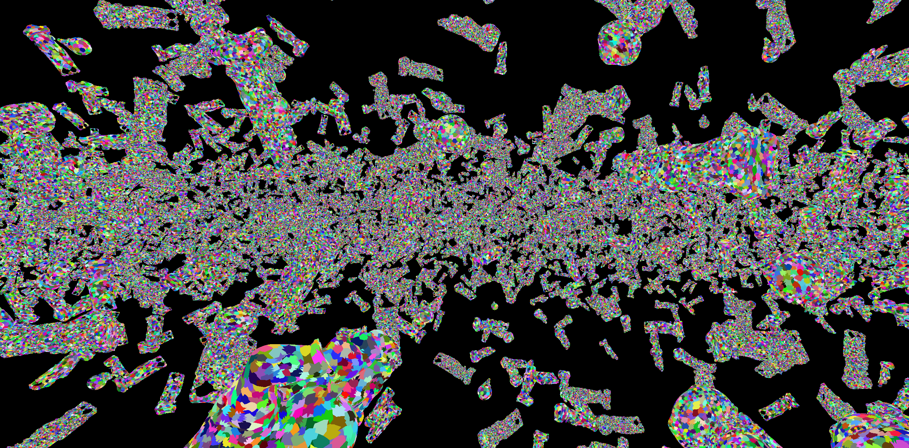
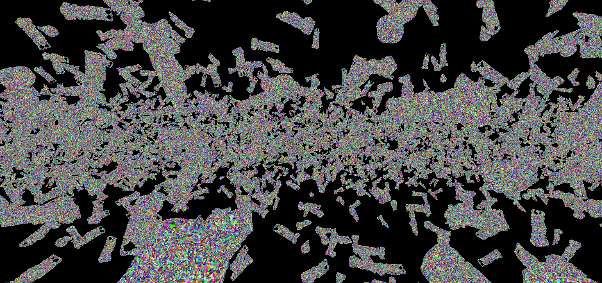
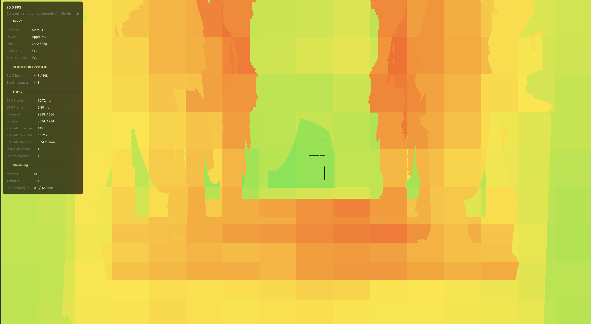

# 🍮 Caramel

An experimental research renderer powered by [AGFX](https://github.com/AmelieHeinrich/agfx), a modern D3D12 / Vulkan / Metal 4 RHI.




## Features

### Rendering
- GPU-driven, mesh-shaded visibility buffer
- Instance frustum & occlusion culling
- Cluster cone / contribution / frustum / occlusion culling
- LOD selection with cross-fade dithering and hysteresis
- Cook-Torrance BRDF with Burley diffuse
- Multiple material support with binning
- Render graph with transient resource allocator
- Clustered light culling
- ReSTIR DI
- Reference pathtracer
- NRD integration
- Upsample/downsample bloom
- Temporal anti-aliasing
- DLSS / FSR / MetalFX support
- HDR output with luminosity heatmap and CIE diagram visualizer

### Engine
- Windows, Linux, and macOS support (D3D12, Vulkan, Metal 4)
- Intuitive editor with mouse picking via Jolt Physics
- Scripting via AngelScript
- Scene system with serialization
- Heavily multi-threaded asset system with copy-queue streaming for textures and meshes
- Custom engine formats for meshes and textures

## Debug Views

| Meshlets | Primitives | Cluster heatmap
| :---: | :---: | :---: |
|  |  |  |

## Building

Caramel uses [xmake](https://xmake.io):

```sh
xmake        # build everything
xmake run Caramel
```
